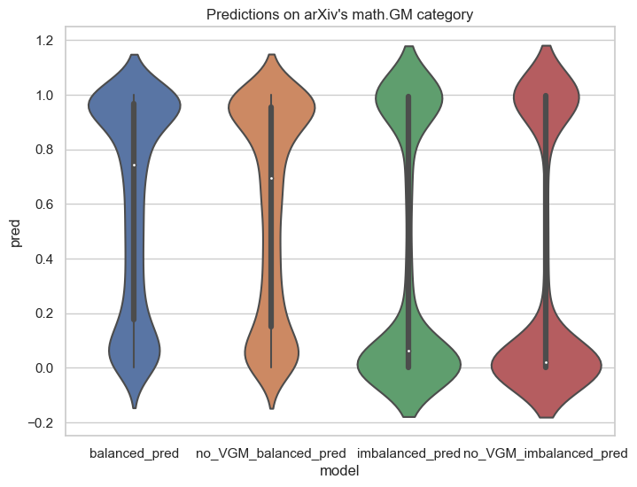
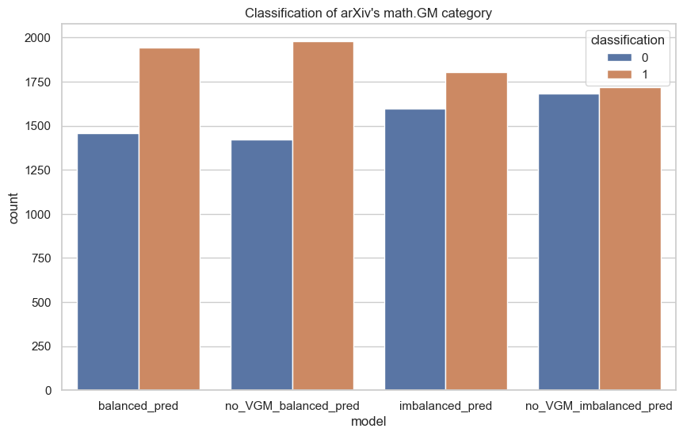

[arXiv.org](https://arxiv.org/) is an open-access e-print archive for research-level math articles operated by Cornell University, and today almost all research-level results find their way to the site. 
To submit an article to arXiv.org, the author must have a university affiliation or be endorsed.

On the other hand, [viXra.org](https://vixra.org/) is an e-print archive which allows anyone to submit articles.
Unfortunately, viXra.org has become synonymous with mathematical crankery: the attempts of unreasonable crackpots trying to prove impossible results.

Yet, arXiv.org's submission requirements are not perfect, and sometimes mathematical crankery appears there too.
Often when this occurs, the article will be moved to the math.GM (General Mathematics) category.
This puts math.GM in the unique situation of containing a significant proportion of both legitimate research-level math and mathematical crankery.

We fine-tune BERT models to categorize articles from math.GM (based on their title, abstract, and number of authors) as more likely to be a legitimate research-level article (label 0) or more likely to be mathematical crankery (label 1). 
For the training data, we label articles from viXra.org as 1, and articles from arXiv.org not belonging to math.GM as 0. 
Although there are some research-level articles on viXra.org and some mathematical crankery on arXiv.org outside of math.GM, we make the assumption that these make up a relatively low proportion of the total data. 
More accurately, we are building a classifier to categorize if an article is styled more in the vein of viXra articles or in the vein of arXiv articles. 
We make the assumption that this categorization can be interpreted as a representation of the quality.

Below are the predictions of the models on the articles from math.GM. In each case, we see there is a bimodal distribution, which agrees with the ground truth.

We also determine an optimal threshold for the classifier and categorize the articles.

Thank you to arXiv for use of its open access interoperability.
